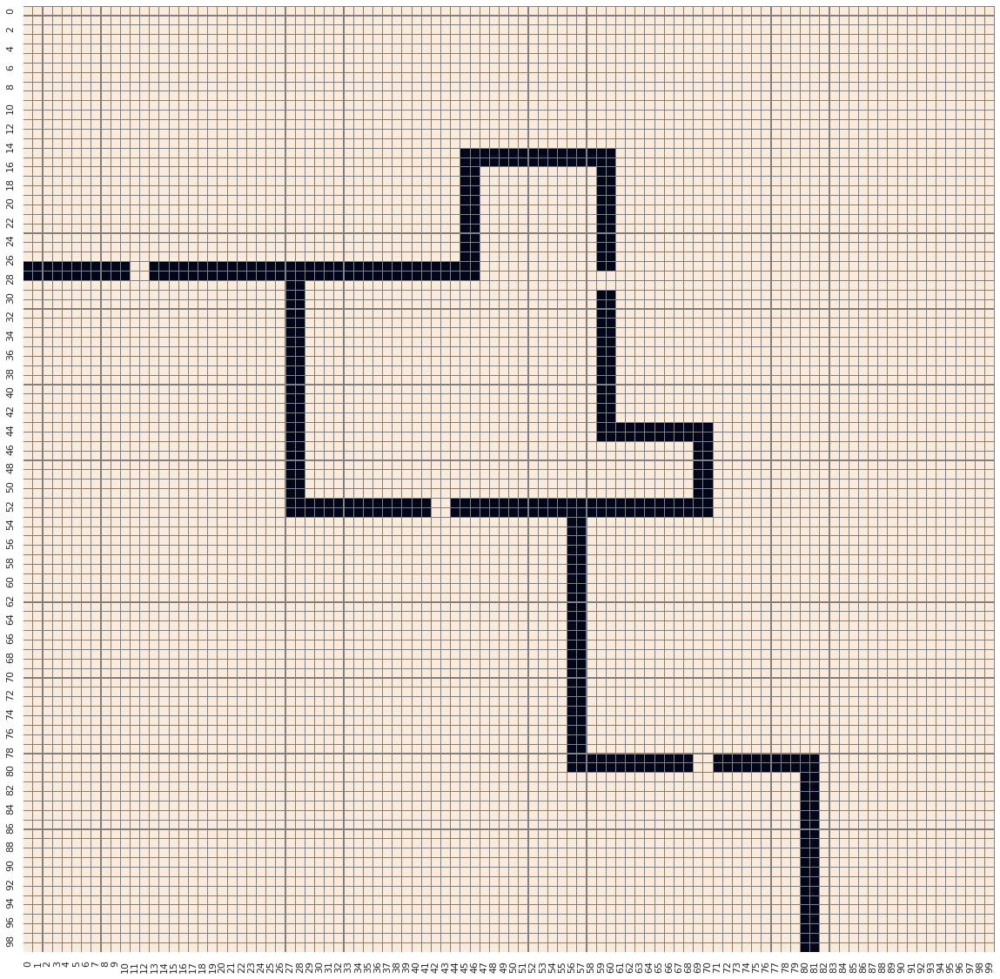

В данном мини проекте реализован код на Python для решения задачи "Навигатор".

Условие задачи:

Представим, что у нас есть город с координатами 100 на 100. Как на уроках геометрии, мы могли бы расположить наш город на координатах X и Y. Для записи координат будем использовать формат (x, y).Район в верхнем левом углу имеет координаты (0, 0) city_map[0][0]. А правый нижний район имел бы координаты (99, 99) city_map[99][99]. Таким образом каждый район закодирован двумя индексами x и y, которые соответствуют его координатам city_map[y][x].

В нашем городе есть большая река с 4-мя мостами, как изображено на картинке ниже. Карта города также закодирована при помощи списка из списков city_map_list.

В переменных **courier_location**, **orders_location**, **city_map_list** сохранены позиции курьера, координаты доставок и карта города.

**courier_location** — tuple из двух целых чисел. Координаты стартового местоположения курьера в формате (x, y). Где x и y — это целые числа от 0 до 9.

Пример courier_location = (10, 10)

**orders_location** — список как минимум из одного tuple с координатами. Координаты, по которым курьер должен доставить заказы. В списке хранится произвольное число tuple с координатами точек назначения, которые должен посетить курьер.

Пример orders_location = [(1, 1), (92, 13), (46, 33)]

**city_map_list** — список из списков 100 на 100, карта города, которую мы загрузили выше. Вам известно местоположение курьера, набор координат мест назначения и карта города. Теперь нужно написать скрипт, который создаст переменную route и сохранит в нее маршрут, по которому должен пройти курьер, чтобы разнести все заказы. При формировании маршрута необходимо выполнить следующие условия:

Маршрут должен проходить только по земле, по воде ходить нельзя. Курьеры могут перемещаться на один шаг из текущего района вправо, влево, вниз или вверх. Маршрут должен быть сохранен в список, где каждый элемент — это tuple с координатами каждого шага курьера. Курьер проходит один шаг за 10 минут и может доставлять заказ в любом порядке.

